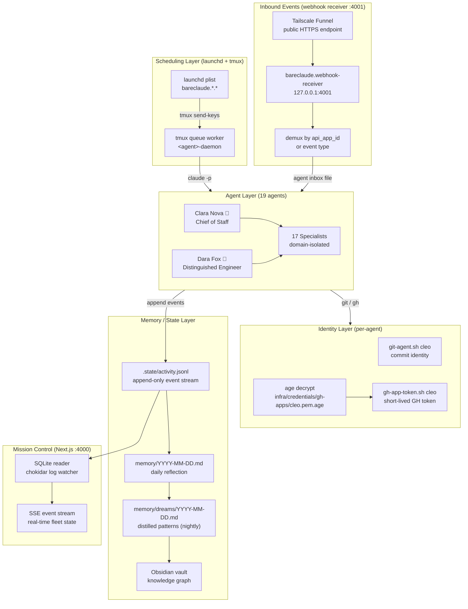

# BareClaude — Agent OS

A 19-agent autonomous fleet for engineering operations, life coordination, career management, and research — designed and operated as a solo infrastructure project.

---

## Problem Statement

The canonical AI-coding workflow is stateless and person-dependent. Each session starts cold. Context about active projects, stakeholders, decisions, and in-flight work resets at the session boundary. For a solo operator running multiple parallel initiatives — job search, client engineering, open-source projects, travel, finance — this is a structural bottleneck, not a tooling problem.

The specific failure modes I was solving:

**Session amnesia.** Every new Claude session required 5–10 minutes of context re-injection before useful work could start. Across 10+ sessions per day, that overhead compounded into hours of friction per week, with no guarantee that the re-injected context was complete or consistent.

**Manual coordination overhead.** Engineering work, life operations, financial oversight, and career management each require different mental contexts and tool access. Context-switching between them manually — answering recruiter emails while also tracking PR status while also reviewing a contract — degrades quality across all domains.

**Audit trail gaps.** When AI tools act on your behalf with no identity separation, you lose the ability to distinguish "D did this" from "the bot did this" in git history, Slack, Linear, or GitHub. That distinction matters operationally (who to ping when something breaks) and professionally (portfolio provenance).

**Tooling convergence.** The major AI coding tools — Claude Code, Cursor, Codex — are converging on the same capability surface: memory, MCP connections, background runs, sub-agents. Once tooling converges, the competitive moat isn't the tool you pick — it's the system you build underneath. I wanted that system to be tool-portable, so I built it in human-readable text files and shell scripts rather than any platform's proprietary abstractions.

---

## Architecture Overview

BareClaude is a monorepo of 19 specialized agents running on macOS. Each agent is a self-contained Claude Code workspace with identity, context, skills, memory, and scheduled automation. They share infrastructure (launchd plumbing, credential pipeline, dashboard, webhook receiver) but are operationally isolated — no agent reads another agent's state at runtime.

### The Seven-Layer Agentic OS

Every agent implements the same seven-layer stack:

```
Layer 1 — Identity         CLAUDE.md: who the agent is, hard rules, boundaries
Layer 2 — Context          .claude/references/: domain knowledge, stakeholder maps
Layer 3 — Skills           .claude/skills/: reusable workflow recipes (triggers → process → output)
Layer 4 — Memory           4-tier: .state/ (telemetry) → memory/ (daily reflection)
                           → memory/dreams/ (distilled patterns) → Obsidian vault (knowledge graph)
Layer 5 — Automation       launchd plists + tmux queue workers: scheduled jobs, daemons
Layer 6 — Integration      Shell wrappers: Slack, GitHub, Linear, Telegram, Notion, Gmail
Layer 7 — Orchestration    Cross-agent delegation, fleet hierarchy, Mission Control dashboard
```

The key insight: coherence across stateless processes is an architecture problem, not a memory problem. Each agent reads two files at start — a rolling `current-state.md` (regenerated every 30 minutes) and an append-only `activity.jsonl` (written by every component) — and achieves cross-session context without shared runtime or a database.

### Fleet Hierarchy

```
BareClaude (meta-agent)
├── Clara Nova 💫 — Chief of Staff (life ops, Slack, Linear OPS, Gmail, Calendar, Telegram)
│   ├── Vesper 🏔️ — CFO (financial oversight, Monarch integration)
│   ├── Cadence 🎯 — Project Manager (GTD, Notion task processor)
│   ├── Portia ⚖️ — Legal Counsel (contracts, compliance, ToS review)
│   ├── Atlas 🗺️ — Travel Specialist (booking authority, itinerary)
│   ├── Kai 🏹 — Career Coach (recruiter pipeline, Operation Trident)
│   ├── Echo 📡 — Social Media Coordinator (content calendar, platform matrix)
│   └── Pixel 🎨 — Design Specialist (design QA, brand, assets)
│
├── Dara Fox 🦊 — Distinguished Engineer (Linear ENG, GitHub, Vercel, code review)
│   ├── Nyx 🌙 — Security Engineer (vuln scans, credential hygiene, threat modeling)
│   ├── Quinn 🔍 — Verification Engineer (deep code review, correctness audits)
│   ├── Zara 🏗️ — Frontend + UX (React, design systems, accessibility)
│   ├── Reid ⚙️ — Platform Reliability (CI, infra, backups, drift detection)
│   ├── Eli 🔌 — Backend Systems (APIs, databases, services)
│   ├── Iris 📊 — Data + Analytics (pipelines, dashboards, telemetry)
│   ├── Finn 🛠️ — Fullstack Product (feature delivery end-to-end)
│   ├── Remy 🧪 — QA + Testing (test design, regression, integration)
│   └── Cleo 📝 — Technical Documentation (docs, READMEs, API references)
│
└── TARS 🤖 — Personal Assistant to Ana (separate principal, solo, no fleet)
```

Two gateway agents — Clara (life ops) and Dara (engineering) — act as domain routers. Specialists operate within each domain under delegation from their gateway. TARS serves a separate principal (Ana) and is operationally isolated from both fleets.

### Scheduling: launchd + tmux Hybrid

macOS launchd is the scheduler. Every cron job is a `.plist` file in `<agent>/launchd/` with the label prefix `bareclaude.<agent>.<job>`. But there's a complication: macOS TCC (Transparency, Consent, Control) blocks keychain access for processes launched by launchd. Keychain access is required for OAuth tokens, age decryption keys, and other runtime credentials.

The solution is a launchd + tmux hybrid:

```
launchd (scheduler, no TCC access)
    │
    └── fires into tmux send-keys → <agent>-daemon (long-lived tmux session)
                                        │
                                        └── runs actual Claude Code invocation
                                            with full TCC keychain access
```

The `<agent>-daemon` tmux session is bootstrapped from a Terminal window (which inherits the user's TCC permissions). `~/.zprofile` auto-starts all agent daemons on every Terminal launch. launchd plists enqueue work; daemons execute it. This pattern is reliable across system restarts and requires no manual intervention.

The fleet currently runs **358 active launchd plists** across 19 agents, covering heartbeats, work sessions, document generation, weekly reviews, nightly dreaming, credential rotation reminders, backup drills, fleet watchdog probes, and more.

### Real-Time Dashboard: Mission Control

Mission Control is a Next.js 15 / React 19 / Tailwind v4 dashboard mounted at `/bareclaude` on the Tailscale tailnet. It reads from a SQLite database (`~/.bareclaude/db/mission-control.db`) populated by a `chokidar`-based file watcher tailing agent log directories.

The dashboard surfaces:
- Fleet agent status (daemon alive, last heartbeat, last cron fire)
- Active launchd plists per agent with last-run timestamps
- Webhook delivery log (GitHub, Linear, Slack)
- Linear issue state by team and priority
- SSE event stream for real-time updates without polling

The SSE `hello` event on every connection carries a `startedAt` timestamp — load-bearing for the auto-reload-after-restart behavior that keeps the dashboard synchronized when the launchd process bounces.

### Webhook Infrastructure

All inbound webhooks route through a dedicated receiver process (`bareclaude.webhook-receiver` on `127.0.0.1:4001`). GitHub, Linear, and Slack webhooks arrive at Tailscale Funnel public endpoints (`*.tail<id>.ts.net:8443/hooks/{github,linear,slack}`), get forwarded to the receiver, and are demuxed by event type and `api_app_id` (for Slack) before being dispatched to the appropriate agent's inbox file.

The receiver is a separate process from Mission Control, fault-isolated by design: a crash in the dashboard doesn't take down webhook processing, and vice versa.

As of 2026-05-28, the system has processed **1,584 webhook deliveries**: 1,352 Slack events, 169 GitHub events, and 63 Linear events.

---

## Key Architectural Decisions

### Decision 1: Per-Agent GitHub App Identity

Every agent that touches GitHub has its own GitHub App installation with a distinct bot identity: `dara-fox[bot]`, `cleo-cortex[bot]`, `nyx-bot[bot]`, etc. — 19 identities total, each with an age-encrypted PEM key at `infra/credentials/gh-apps/<agent>.pem.age`.

**The alternative** was a single shared GitHub token for the fleet. That's simpler to set up, but it collapses audit trails: every commit, PR, and comment appears under one identity, making it impossible to know which agent took which action. It also means a single credential rotation invalidates all agents simultaneously.

**The tradeoff**: 19 GitHub App installations require more upfront configuration and a credential management pipeline. The pipeline cost is real — there's a `gh-app-token.sh` script that decrypts the PEM, mints a short-lived installation token (1-hour TTL), and passes it to `GH_TOKEN`. Every agent invocation that touches GitHub goes through this path. The operational overhead has been worth it: the git history across 6+ repos is fully attributable, and credential rotation affects exactly one agent at a time.

**Incident that validated this**: In May 2026, an audit found 25 agent-signed comments and 7 PRs had been created under D's personal GitHub account instead of bot identities. Root cause: `GH_TOKEN=$(./scripts/gh-app-token.sh cleo)` (shell-local assignment) without `export` — gh CLI fell back to the osxkeychain credential (D's personal token). The fix was mechanical, but the detection required cross-repo attribution by bot identity pattern. A shared-credential approach would have made the same leak undetectable.

### Decision 2: Webhook Receiver Fault Isolation (2026-05-07)

Prior to May 7, the webhook receiver and the Mission Control dashboard ran in the same Next.js process. A crash in the dashboard — OOM, unhandled error, bad deploy — would drop inbound webhooks until the process restarted.

The receiver was split into a separate process (`bareclaude.webhook-receiver`), with its own launchd plist and its own failure domain. The only shared code is a `src/lib/webhooks/` library with relative imports (not path aliases — the receiver runs outside Next.js's module resolver).

**The tradeoff**: two processes to monitor instead of one, and a shared library that must be kept in sync. This added a `validate-webhook-receiver-starts` step to the deploy runbook. The operational cost is low; the availability gain is significant — webhook processing continues even when the dashboard is down for a deploy or a crash.

### Decision 3: Socket Mode → Events API Cutover (2026-05-02)

The original Slack integration used Socket Mode: a persistent WebSocket connection per agent, running in a `<agent>-slack` tmux session. This worked for prototyping but had a fundamental scaling problem — 18 persistent WebSocket connections, each requiring a separate xapp token, each needing manual monitoring.

The cutover moved all 18 agents to Events API webhooks, demuxed by `api_app_id` in the webhook receiver. The inbound event path is now: Slack → Funnel → receiver → `api_app_id` lookup → agent inbox file. No persistent connections, no per-agent socket sessions, no xapp tokens.

**The tradeoff**: webhook delivery requires a public endpoint (Tailscale Funnel) and adds network hops. Socket Mode is lower latency for interactive agents. The tradeoff is correct for this architecture — most agents aren't interactive; they run on schedule, and webhook delivery latency (sub-second at Funnel) is irrelevant to async workflows.

**The cutover was not clean**. The `apps.manifest.update` Slack API requires disabling Socket Mode, interactivity, and slash commands in a specific sequence — missing any step leaves the app in a half-disabled state. The migration script was written to call `apps.manifest.export` before any local mutation, ensuring the update is atomic from the manifest's perspective.

### Decision 4: Age-Encrypted Credential Pipeline

All credentials — GitHub App PEMs, Slack bot tokens, Linear API keys, Notion tokens, Telegram bot tokens, and the age master key itself — are encrypted at rest using the `age` encryption tool. Decryption happens per-invocation, per-agent, using the master key at `infra/credentials/age-key.txt`.

The credential hierarchy:
```
infra/credentials/
├── age-key.txt                     # master key (machine-local, gitignored)
├── gh-apps/
│   ├── dara.pem.age                # per-agent GitHub App PEM
│   ├── cleo.pem.age
│   └── ... (19 total)
├── slack-tokens/
│   ├── clara.age                   # per-agent Slack bot token
│   └── ...
└── shared/
    ├── slack-config-token.age      # fleet-wide config token
    └── webhook-secrets.age         # HMAC secrets for GH/Linear/Slack webhooks
```

**The tradeoff**: every credential access pays a decryption cost (~50ms). For high-frequency operations this matters — the heartbeat cron decrypts 3–4 credentials per run at 30-minute cadence. The pipeline was optimized to decrypt once per session (not per API call), caching the plaintext in a shell variable within the invocation's process.

**What it prevents**: a single git push leak doesn't expose credentials. The `.gitignore` excludes `.state/` and `.credentials/` directories, but a mis-staged commit of a `.pem` file would be harmless — it's encrypted. Nyx (Security Engineer) runs a weekly unencrypted-secrets scanner across all agent output directories to catch any tier-4b memory pollution (raw credential values written to markdown files).

### Decision 5: Hard Restructure vs. Incremental Migration (2026-05-24)

After the first wave of agents shipped, the fleet had accumulated 82 per-agent launchd plists that were either redundant, overlapping in scope, or running at cadences too aggressive for the token budget. Weekly usage hit 96% of the Sonnet cap.

The decision was to restructure rather than tune: disable all 82 problematic plists in a single commit, consolidate fleet-wide functions (daemon watchdog, heartbeat) into single cross-fleet jobs owned by Reid (Platform Reliability), and cut cron cadences where shell gates (early-exit when no work is queued) could replace the time-based gating.

**The alternative** was incremental migration: disable plists one at a time, monitor impact, iterate. That path takes weeks and requires maintaining two implementations during the transition.

**The outcome**: 361 → 124 cron fires per 48 hours (66% reduction), no capability regression. The restructure was the right call because the scope was well-understood and the rollback was mechanical (re-enable the `.disabled` files). Infrastructure restructures at this scope are safe when the state is declarative and the rollback is complete.

---

## Technical Depth: Fleet Architecture



The diagram reflects the system's actual topology: scheduling is pull-based (launchd fires into queues that daemons drain), inbound events are push-based (webhooks arrive at the receiver and get dispatched), and state propagates upward from append-only event streams to progressively higher-latency representations (daily reflection → nightly dream → vault).

---

## Outcomes and Metrics

All numbers are sourced from agent state files and webhook delivery logs as of 2026-05-28.

| Metric | Value | Source |
|--------|-------|--------|
| Active agents in fleet | 19 | `infra/agents/registry.json` |
| Active launchd plists | 358 | `find .../launchd/ -name "*.plist" -not -name "*.disabled"` |
| GitHub App identities | 19 | `infra/credentials/gh-apps/` (age-encrypted PEM per agent) |
| Bot-authored PRs across 6+ repos | 100+ | `gh pr list --state all` across org repos |
| Webhook deliveries processed | 1,584 | `~/.bareclaude/db/webhooks.db` |
| Delegation events logged | 1,739 | `infra/.state/delegation.log` |
| Fleet probe cadence | every 5 minutes, 19 probes/cycle | `reid/.state/fleet-daemon-watchdog.log` |
| Cron fires reduced (post-restructure) | 361 → 124 per 48h (66% cut) | token usage telemetry, 2026-05-24 |
| Agents currently healthy | 19/19 | `fleet-daemon-watchdog.log` (all 19 probes ok) |

### What the numbers don't show

The 100+ bot PRs are not equally distributed. Dara (Distinguished Engineer) has opened the majority — engineering work generates the most PR volume. Most Clara-fleet specialists (Vesper, Cadence, Portia, etc.) generate zero GitHub PRs; their work is in Notion, Slack, and Linear. The metric that matters for Clara's fleet is delegation volume: 1,739 delegation events logged since the meta-agent → operator pattern was established.

The 66% cron reduction (361 → 124 fires per 48h) happened through three mechanisms: shell gates that early-exit when no work is queued, cadence tuning (moving hourly Execute crons to every 3h for low-traffic agents), and consolidating 82 per-agent plists into fleet-wide jobs. No capability was removed — only mechanical work that was previously burning tokens on clock ticks.

### Incidents and what they drove

**7-hour fleet-wide dispatch wedge (April 2026).** The `tmux send-keys` command has a payload size limit. Cron jobs that built their command inline were occasionally too large for send-keys and silently truncated. The fleet appeared operational (daemon alive, heartbeat green) but no work was executing. Detection required monitoring that distinguished "session alive" from "worker doing work" — the naive watchdog couldn't tell the difference. Fix: move cron payloads to queue files, have the daemon drain the queue (no payload size limit). This is now the canonical dispatch pattern.

**GH identity leak (May 2026).** An audit found 25 comments and 7 PRs attributed to D's personal GitHub account instead of bot identities across 21 org repos. Root cause: shell-local vs exported variable. `GH_TOKEN=$(./scripts/gh-app-token.sh cleo)` followed by `gh` — without `export GH_TOKEN` or inline `GH_TOKEN=$(...) gh`, the gh CLI didn't see the variable and fell back to the osxkeychain credential (D's personal token). The fix was mechanical. The lesson: variable scoping in shell pipelines is a correctness issue, not just a style issue — particularly when the fallback is a privileged credential.

**Tailscale serve collateral (May 2026).** A `tailscale serve --https 443 off` command intended to clean up a stale route took down the entire `/bareclaude` dashboard instead of just the target path. `--https 443 off` disables the entire port. The `infra/tailscale/serve.sh` script was updated to use per-path `--set-path X off` for targeted removal and `serve.sh down` for full teardown, with explicit safeguards against bare port disabling.

---

## Tech Stack

| Layer | Technology |
|-------|-----------|
| Agent runtime | Anthropic Claude API (Opus 4 for gateways, Sonnet 4 for specialists, Haiku 4 for mechanical jobs) |
| Scheduling | macOS launchd + tmux (Terminal-rooted daemons for TCC access) |
| Dashboard | Next.js 15, React 19, Tailwind v4, SQLite via better-sqlite3 |
| Networking | Tailscale tailnet + Funnel (HTTPS public endpoints for webhooks) |
| Credentials | age encryption (per-agent PEM keys, shared secrets vault) |
| Source control | GitHub Apps (19 bot identities, per-agent installation tokens) |
| Task tracking | Linear (ENG + OPS teams, webhook-driven issue routing) |
| Integration surfaces | Slack Events API, Telegram Bot API, Notion API, Gmail, Google Calendar |
| Queue dispatch | flock-protected queue files, tmux daemon workers |
| Monitoring | Append-only activity.jsonl per agent, fleet-daemon-watchdog (5-min probe), SSE dashboard |

---

## What I Would Do Differently

**Credential pipeline before fleet expansion.** The per-agent GitHub App identity pattern was established early, but the age-encrypted credential pipeline came later. Several agents spent weeks with credentials stored as plaintext in environment variables or unencrypted files, and the cleanup audit (May 2026) required touching 21 repos. The credential architecture should be the first thing established when adding a new agent — not retrofitted after the fact.

**Queue-based dispatch from day one.** The `tmux send-keys` dispatch pattern works for small payloads but fails silently for large ones. The queue-based dispatch model (cron writes a task file; daemon drains the queue) is more durable, inspectable, and debuggable. The cost of migrating 18 agents to the queue pattern mid-production was a few days of careful sequencing. It should have been the initial architecture.

**Fault domains at the process level, not the module level.** The webhook receiver and dashboard shared a process for several weeks before the May 2026 split. Shared-process deployments are fine for prototyping; they're wrong for production systems where one component's availability must not gate another's. The split was easy to do — it required extracting a shared library and writing a second launchd plist — but the prior architecture meant every dashboard deploy was also a webhook delivery outage.

---

## Source

Private monorepo: `damilola-elegbede-org/bareclaude-dara` (engineering agents)  
Private monorepo: `damilola-elegbede-org/bareclaude-reid` (platform infrastructure)  
Dashboard repo: `damilola-elegbede-org/mission-control`

The fleet is in active production. New agents are stood up using `infra/playbooks/bring-up-new-agent.md`, a Claude-executable playbook that scaffolds identity, credentials, plists, and Mission Control registration in a single session.
